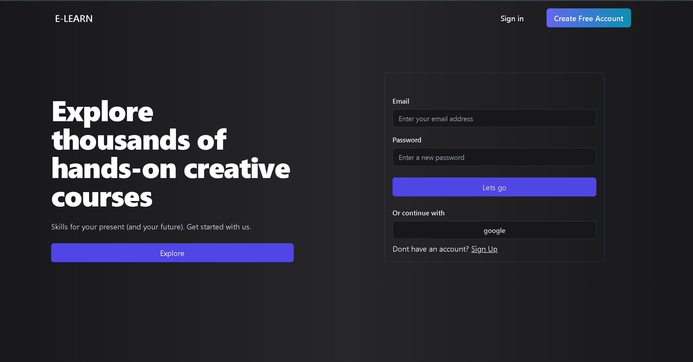
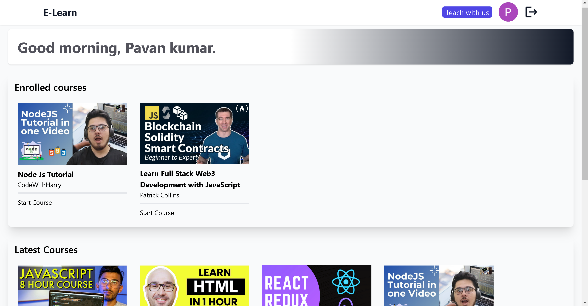
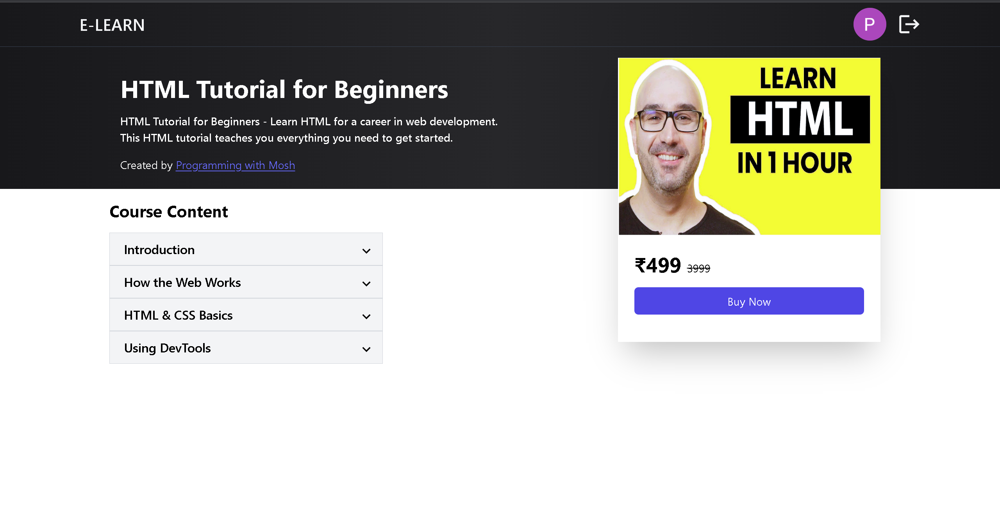
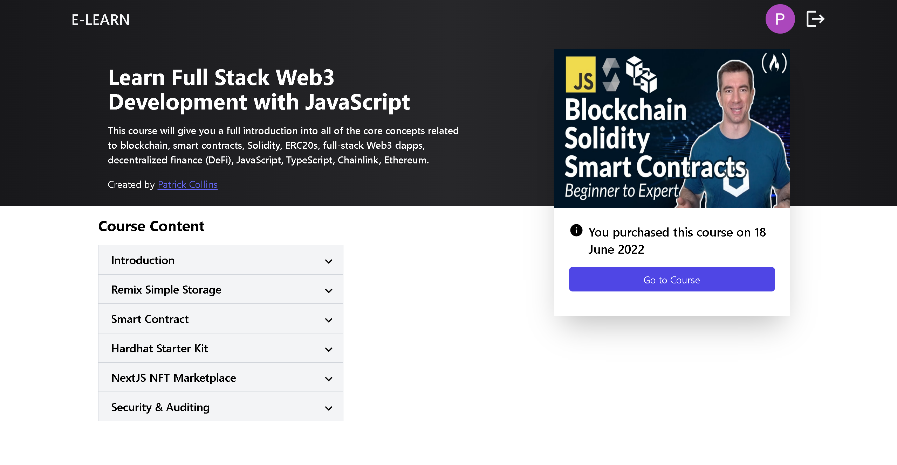
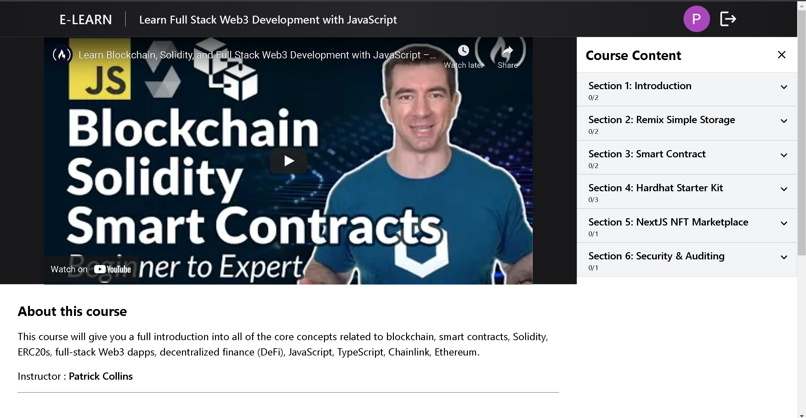
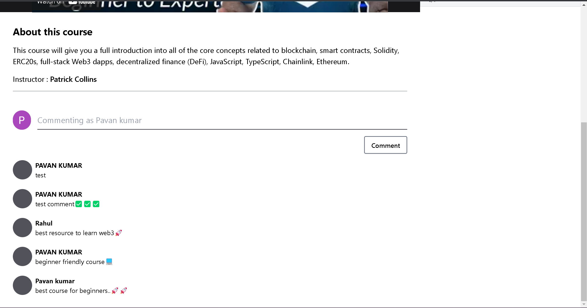
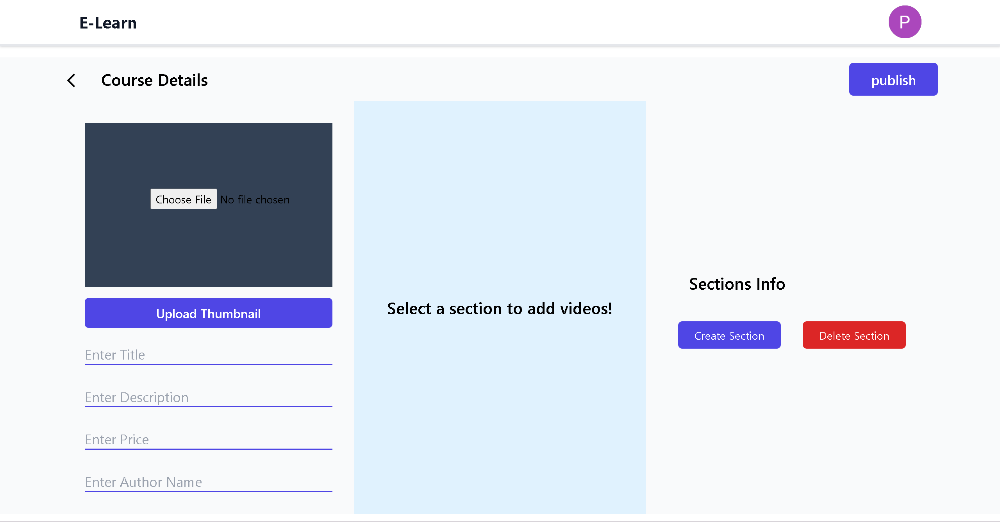

# E-Learn 💻

##### A simple web application for learning high demand courses from your comfort places💻

##### User can enroll for latest Courses and publish new courses.🚀

## Screenshots📷

### SignIn and SignUp Page

- Users can create an account and sigin to application.
  

### User DashBoard

- User can view enrolled courses and latest courses
  

### Course Details Page

- Details about the course can be accessed here and also user can buy the course.
  

### Course Details Page after user enrolled.

- Details about the course can be accessed here and user can proceed to learning page.
  

### Learning Page.

- User can watch videos
  

### Comments section.

- User can give comments as feedback for course videos.
  

### Course Publish Page.

- User can upload a course.
  
  # [Live Demo🎉🎉]()
  ### working on deploying the application (will update the live demo)
  ---
#### What you need to run this code
1. Node (13.12.0)
2. NPM (6.14.4) or Yarn (1.22.4)
3. MongoDB (4.2.0)

####  How to run this code
1. Make sure MongoDB is running on your system 
2. Clone this repository
3. Open command line in the cloned folder,
   - To install dependencies, run ```  npm install  ``` or ``` yarn ```
   - To run the application for development, run ```  npm run development  ``` or ``` yarn development ```
4. Open [localhost:3000](http://localhost:3000/) in the browser
---- 
## Authors

- [@01-pavan](https://github.com/01-pavan)

